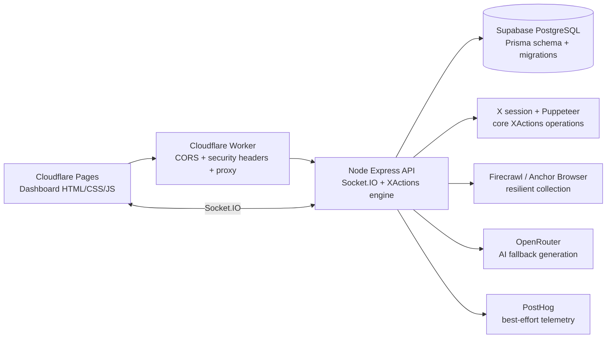

# XActions Dashboard Production Runbook

## Architecture



Cloudflare Pages serves the static dashboard bundle. The Worker is an edge gateway and must not contain database service-role keys or X session cookies. The Node API remains the execution boundary for Puppeteer, Prisma, Socket.IO, and integrations that need server-side secrets. Supabase PostgreSQL is accessed through Prisma using pooled request traffic and a direct migration URL when Supabase provides one.

## Local start

```bash
cp .env.example .env
npm install
npm run db:generate
npm run db:migrate:deploy
npm run dev
npm run healthcheck
```

The dashboard is served by the API at `http://localhost:3001`. Set `FRONTEND_URL` and `CORS_ORIGINS` to the actual browser origin used in local development.

## Supabase migration

```bash
export DATABASE_URL='postgresql://...pooler.supabase.com:6543/postgres?pgbouncer=true'
export DIRECT_URL='postgresql://...db.<ref>.supabase.co:5432/postgres'
npm run db:generate
npm run db:migrate:deploy
```

Review migration SQL in `prisma/migrations/` before applying it to shared environments. Never use `prisma db push` against production.

## Cloudflare Pages and Worker deployment

Authenticate once with `npx wrangler login`, then configure the Pages project and Worker secrets:

```bash
export CLOUDFLARE_PAGES_PROJECT=xactions
export CLOUDFLARE_PAGES_BRANCH=main
# Replace the two production placeholders in cloudflare/wrangler.toml, or pass
# equivalent --var values to wrangler deploy in your CI environment.
npm run deploy:cloudflare:stack
```

The Node API must be deployed separately to a service that supports long-running HTTP requests, WebSockets, Puppeteer, and Prisma. Set its production environment from `.env.example`, including `DATABASE_URL`, `DIRECT_URL`, `JWT_SECRET`, `COOKIE_ENCRYPTION_KEY`, `FRONTEND_URL`, `CORS_ORIGINS`, and any provider keys required by enabled features.

## External enhancement providers

The enhanced routes are protected by the same auth middleware as the core API:

| Route | Provider | Purpose |
|---|---|---|
| `POST /api/enhanced/scrape/firecrawl` | Firecrawl | Markdown/HTML resilient scrape |
| `POST /api/enhanced/scrape/anchor` | Anchor Browser | Rendered/browser-backed webpage fetch |
| `POST /api/enhanced/ai/chat` | OpenRouter | Fallback generation and analysis |
| `GET /api/enhanced/status` | All | Safe configured/not-configured health state |

These providers enhance native XActions behavior; they do not replace Puppeteer-backed X actions, graph crawling, workflows, or existing AI routes. Upstream calls use timeouts and return sanitized error messages. Provider keys remain server-side.

## Dashboard page status

| Page | Status | Primary contract |
|---|---|---|
| Home, Run, Automations | Complete | API actions, loading/error/success feedback, Socket.IO progress |
| Social Graph | Complete | D3 force graph, filters, details, export, async completion events |
| Workflows | Complete | Visual builder, real action names, triggers, conditions, save/run/pause/resume, progress rooms |
| Unfollowers | Complete | Scan, changes, chart, schedule, block/visit actions |
| Analytics, Advanced Analytics | Complete | API-backed charts, explicit empty/error states, export |
| Monitor | Complete | Socket.IO activity, health panels, empty state, automation controls |
| Thread Composer, Calendar | Complete | Existing scheduling/composition APIs and validation states |
| AI | Complete | Native XActions AI writer plus OpenRouter fallback |
| Video | Complete | Extract/download/history flow with API error state |
| Admin, Team, Integrations | Complete | Protected administration/team APIs and integration health panel |

## Extension guide

Add a new API capability under `api/routes/`, protect it with `authenticate`, place provider calls in `api/services/`, and emit lifecycle telemetry through `captureEvent` without blocking the request. Add a Prisma migration for durable state, expose the route in `api/server.js`, then add a page client under `dashboard/js/` with loading, empty, success, and error states. For realtime features, use the authenticated Socket.IO namespace/room pattern in `api/realtime/socketHandler.js` and update the dashboard client only from server events.
